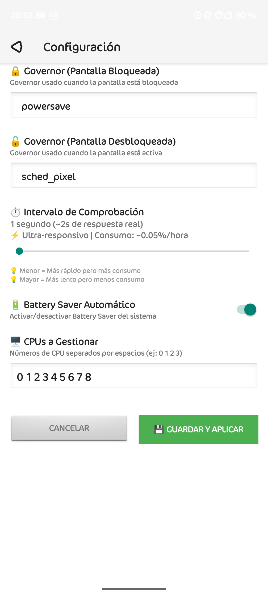
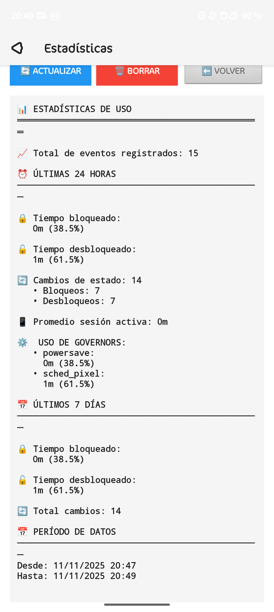
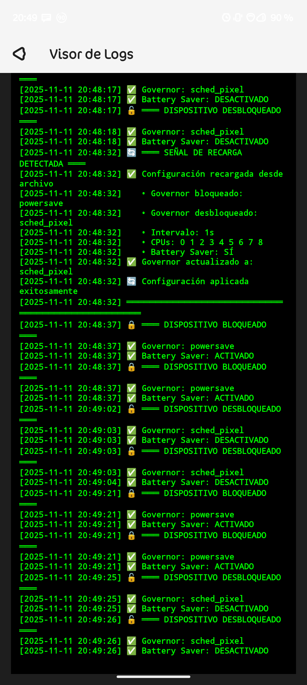

# LockScreen Battery Saver

Sistema avanzado para dispositivos Android rooteados que activa automáticamente el modo Battery Saver al bloquear la pantalla y gestiona los governors de la CPU para maximizar el ahorro de energía en standby.

***


## Capturas de pantalla

<p align="center">
  
  
</p>

<p align="center">
  
  
</p>


## Tabla de Contenidos
- [Descripción General](#descripcin-general)
- [Características Principales](#caracter3sticas-principales)
- [Arquitectura del Sistema](#arquitectura-del-sistema)
- [Estructura del Proyecto](#estructura-del-proyecto)
- [Requisitos](#requisitos)
- [Instalación](#instalaci1n)
- [Uso](#uso)
- [Solución de Problemas](#soluci3n-de-problemas)
- [Contribuciones](#contribuciones)
- [Licencia](#licencia)
- [Contacto](#contacto)

***

## Descripción General
LockScreen Battery Saver está diseñado para superar las restricciones de Android 14 y versiones superiores, permitiendo la activación automática del modo Battery Saver y la gestión del perfil del CPU governor al bloquear la pantalla, sin necesidad de intervención manual. El sistema es idóneo para ROMs personalizadas y dispositivos que cuenten con acceso root y Magisk.

***

## Características Principales
- Activación automática de Battery Saver al bloquear la pantalla
- Cambio dinámico entre governors de CPU: `powersave` e `interactive`
- Integración completa con Magisk mediante un módulo dedicado
- App instalada como aplicación de sistema (priv-app) para control y revisión de logs
- Compatible con Android 14 y superior
- Proceso de instalación seguro usando 7-Zip y PowerShell
- Logs accesibles para el usuario desde la app

***

## Arquitectura del Sistema
El funcionamiento se apoya en una arquitectura modular compuesta por tres partes bien diferenciadas:

1. **Módulo Magisk**
   - Instala la app como `priv-app`
   - Aplica permisos especiales mediante XML de privilegios
   - Ejecuta scripts automáticos al iniciar el sistema
2. **App Privilegiada**
   - Permite revisión de logs y personalización de parámetros
   - Controla el modo Battery Saver a nivel de sistema gracias a permisos elevados
3. **Scripts de Automatización**
   - Detectan el estado de pantalla (bloqueada/desbloqueada)
   - Cambian el governor y activan/desactivan Battery Saver
   - Generan y mantienen logs accesibles


***

## Estructura del Proyecto
Consulta el diagrama  para localizar rápidamente los componentes principales: scripts, app, documentación y archivos esenciales del sistema.

***
**Estructura resumida del proyecto:**
```text
LockScreenBatterySaver/
  magisk_module/
  system/priv-app/BatterySaverToggle/BatterySaverToggle.apk
  system/etc/permissions/privapp-permissions-batterysaver.xml
  service.d/govbattery.sh
  android_app/
  (proyecto completo de Android Studio)
  docs/
     INSTALLATION.md
     ARCHITECTURE.md
     TROUBLESHOOTING.md
```


## Requisitos
- Android 14 o superior
- Dispositivo rooteado con Magisk v28+
- Android Studio instalado para compilar la app
- 7-Zip instalado en el sistema
- PowerShell y drivers ADB instalados

***

## Instalación (Resumen)
1. Compila la app con Android Studio y copia el archivo APK a:
   - `magisk_module/system/priv-app/BatterySaverToggle/BatterySaverToggle.apk`
2. Verifica la presencia de los archivos de permisos y scripts dentro del módulo.
3. Empaqueta el módulo usando PowerShell y 7-Zip:
   ```powershell
   7z a -tzip ../LockScreenBatterySaver-magisk.zip *
   ```
4. Transfiere el archivo ZIP al teléfono mediante ADB:
   ```
   adb push ../LockScreenBatterySaver-magisk.zip /sdcard/
   ```
5. Instala el módulo desde Magisk Manager y reinicia.
6. Una vez reiniciado, la app se instalará como privilegio del sistema y el ahorro automático estará funcionando.

Para instrucciones detalladas, revisa `docs/INSTALLATION.md`.

***

## Uso
- Al instalar y reiniciar, el sistema activa el modo Battery Saver y el governor `powersave` automáticamente al bloquear la pantalla, y vuelve al modo `interactive` al desbloquear.
- Abre la app para revisar logs y ajustar parámetros de configuración.
- Puedes monitorizar los logs vía terminal:
  ```
  adb shell tail -f /data/adb/service.d/govbattery.log
  ```

***

## Solución de Problemas
Dirígete a `docs/TROUBLESHOOTING.md` si enfrentas:
- La app no aparece tras instalar el módulo
- Permisos insuficientes para modificar el governor o activar Battery Saver
- Errores al empaquetar o instalar el módulo Magisk
- Incompatibilidades con ciertas ROMs personalizadas

***

## Contribuciones
Tu colaboración es bienvenida. Para contribuir, sigue estos pasos:
1. Realiza un fork del repositorio
2. Crea una rama propia para tu aporte
3. Documenta claramente tus cambios y resultados
4. Envía un Pull Request con una descripción completa

Consulta la [guía de contribución](CONTRIBUTING.md) para más detalles.

Portfolio: [portfolio.pesoz.i234.me](https://portfolio.pesoz.i234.me)  
LinkedIn: [Ivan Jonas](https://www.linkedin.com/in/ivanjonasfc/)

***

## Licencia
Este proyecto está bajo licencia MIT. Para más detalles, consulta el archivo `LICENSE`.

***

## Contacto
- Puedes crear un issue en GitHub para soporte o sugerencias.
- Contacto profesional por LinkedIn: [Ivan Jonas](https://www.linkedin.com/in/ivanjonasfc/)
- Portafolio: [portfolio.pesoz.i234.me](https://portfolio.pesoz.i234.me)
