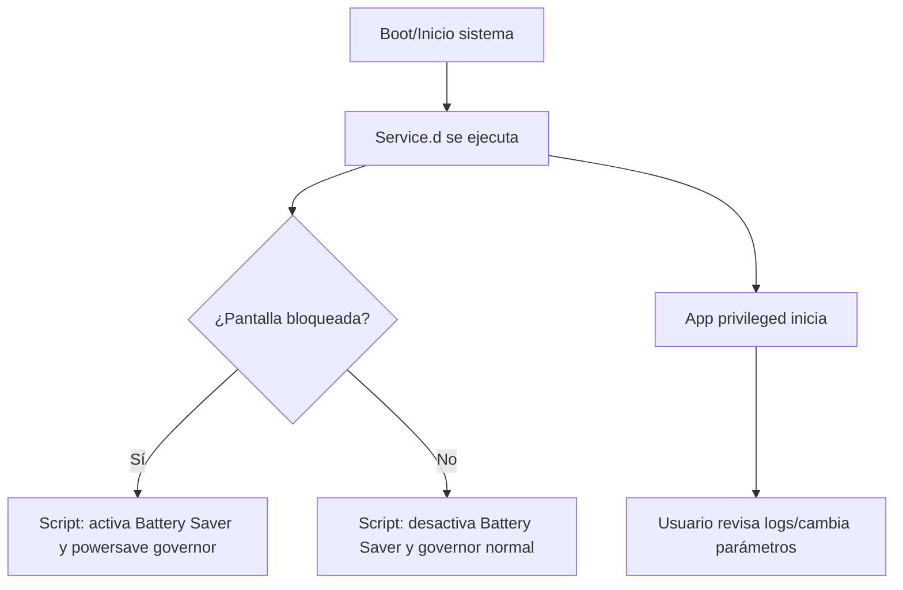

***

# Descripción General

LockScreen Battery Saver utiliza una arquitectura híbrida para sortear las nuevas limitaciones de Android 14 y superior, automatizando el modo Battery Saver y la gestión de governors únicamente con permisos de root y **sin desbloqueo activo**.  
El sistema se divide en tres componentes principales:

***

## 1. Módulo Magisk

**Ubicación:**  
```text
/magisk_module/
```

**Responsabilidades:**

- Posiciona la app como aplicación del sistema (`priv-app`).
- Añade el archivo de permisos privilegiados (`privapp-permissions-batterysaver.xml`).
- Instala scripts automáticos en `/data/adb/service.d/` para ejecutarse al arrancar.

**Rol:**  
Funciona como la capa de integración que permite que app y scripts tengan acceso de sistema sin limitaciones de usuario.

***

## 2. App Privilegiada

**Ubicación:**  
```text
/magisk_module/system/priv-app/BatterySaverToggle/BatterySaverToggle.apk
```

**Responsabilidades:**

- Proporciona una interfaz básica para monitorizar el estado, logs y personalizar parámetros del ahorro de batería y governor.
- Utiliza PowerManager (acceso privilegiado) para activar/desactivar el modo Battery Saver directamente desde la lockscreen.
- Expone logs y configuración accesibles para el usuario root/intermedio.

***

## 3. Scripts de Automatización

**Ubicación:**  
```text
/magisk_module/service.d/govbattery.sh
```

**Responsabilidades:**

- Supervisa el estado de la pantalla (encendida/apagada).
- Cambia governors a powersave/interactive y activa/desactiva el Battery Saver según el bloqueo/desbloqueo de pantalla.
- Genera logs para depuración y monitoreo.

***

## Esquema del Flujo de Trabajo

Si usas Mermaid en GitHub, puedes copiar esto directamente para visualizar el diagrama:



***

## Ventajas

- Altísima integración, funcionamiento 100% automático y sin intervención manual tras la instalación.
- Supera restricciones estándar de Battery Saver gracias a privilegios de sistema.
- Modular: puedes adaptar scripts o lógica de la app según necesidades futuras.

***

> **Nota:**  
> El uso privilegiado solo es posible gracias a la combinación de Magisk y los permisos correctamente aplicados en la estructura del módulo.

***
