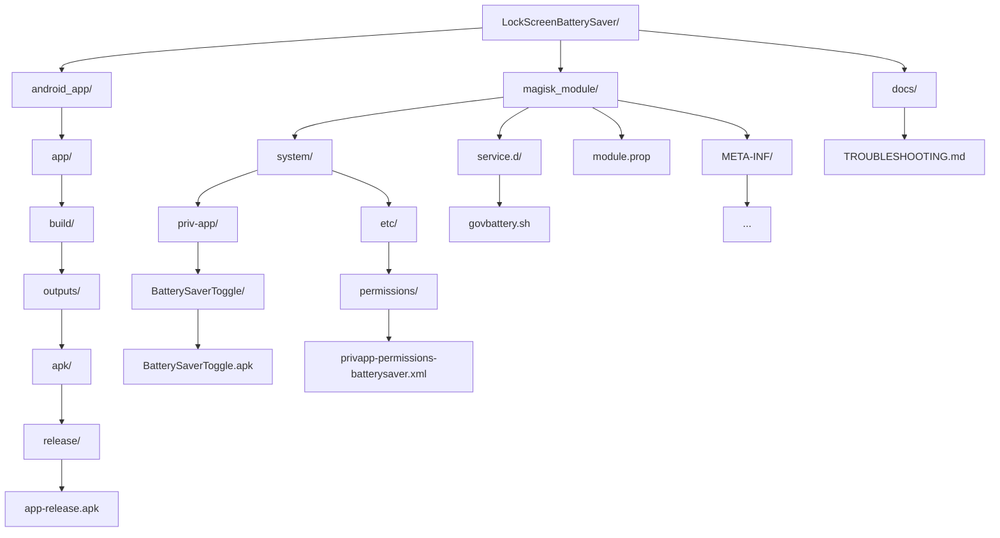

***

# Guía de Instalación Profesional: LockScreen Battery Saver para Android

Bienvenido a la guía profesional de instalación de LockScreen Battery Saver para Android.  
Sigue estos pasos para compilar, empaquetar e instalar correctamente el módulo Magisk y la aplicación en tu dispositivo.

***

## 🧩 Requisitos Previos

- Dispositivo Android con root y **Magisk v28 o superior**
- Android 14 o superior
- **7-Zip** instalado y agregado a la variable de entorno (para compilar el módulo)
- **PowerShell** (Windows 10/11, o usa la terminal integrada de VS Code)
- **Cable USB** y **drivers ADB** instalados

***

## ⚙️ 1. Compilar la Aplicación Android

1. Abre tu proyecto Android en Android Studio.  
2. Compila el APK en **modo release**:

   En Android Studio:  
   ```
   Build > Build Bundle(s) / APK(s) > Build APK(s)
   ```

3. El APK generado estará en la siguiente ruta:

```text
android_app/app/build/outputs/apk/release/app-release.apk
```

***

## 📦 2. Insertar el APK dentro del Módulo Magisk

Copia el archivo `app-release.apk` compilado dentro de la estructura del módulo Magisk:

```text
magisk_module/system/priv-app/BatterySaverToggle/BatterySaverToggle.apk
```

Verifica que el archivo de permisos XML esté presente:

```text
magisk_module/system/etc/permissions/privapp-permissions-batterysaver.xml
```

Asegúrate de que los archivos complementarios estén correctamente ubicados:

```text
# Script principal del módulo
magisk_module/service.d/govbattery.sh

# Propiedades del módulo
magisk_module/module.prop
```

***

## 🧰 3. Empaquetar el Módulo Magisk (de forma segura)

Desde PowerShell (recomendado para evitar errores de rutas o caracteres), navega hasta la carpeta raíz del módulo y empaqueta su contenido.

1. Abre PowerShell y navega al directorio del módulo:

```powershell
cd "C:\Users\TU_USUARIO\Desktop\LockScreenBatterySaver\magisk_module"
```

2. Usa 7-Zip para empaquetar el módulo completo en un archivo `.zip`:

```powershell
7z a -tzip ../LockScreenBatterySaver-magisk.zip *
```

Esto crea el archivo:

```text
C:\Users\TU_USUARIO\Desktop\LockScreenBatterySaver\LockScreenBatterySaver-magisk.zip
```

El archivo `.zip` resultante estará listo para ser flasheado con Magisk.

***

## 🔄 4. Transferir el Módulo a tu Dispositivo

Conecta el dispositivo Android mediante USB (con la depuración activada).  
Usa ADB para transferir el archivo ZIP al almacenamiento interno:

```bash
adb push ../LockScreenBatterySaver-magisk.zip /sdcard/
```

Comprueba que el archivo se haya copiado correctamente:

```bash
adb shell ls /sdcard/ | grep LockScreenBatterySaver
```

***

## 🧩 5. Instalar el Módulo mediante Magisk Manager

1. Abre **Magisk Manager** en tu dispositivo Android.  
2. Pulsa en “Instalar desde almacenamiento” (Install from Storage).  
3. Selecciona el archivo:

```text
/sdcard/LockScreenBatterySaver-magisk.zip
```

4. Espera a que finalice la instalación y **reinicia el dispositivo** cuando se te solicite.

***

## 🧪 6. Verificar el Funcionamiento

El módulo se aplicará automáticamente al arrancar el sistema.  
La app LockScreen Battery Saver se instalará como aplicación de sistema y podrás acceder a su configuración directamente.

Para visualizar logs en tiempo real:

```bash
adb shell tail -f /data/adb/service.d/govbattery.log
```

Si deseas confirmar que el script del módulo se está ejecutando:

```bash
adb shell ps -ef | grep govbattery
```

Para revisar permisos y ubicación de la app del sistema:

```bash
adb shell ls -l /system/priv-app/BatterySaverToggle/
```

***

## 📘 Notas y Sugerencias

- No instales manualmente el APK; se instalará automáticamente como aplicación del sistema al aplicar el módulo.  
- Para desinstalar, elimina el módulo desde Magisk y reinicia el dispositivo.  
- Si modificas scripts o archivos del módulo, vuelve a empaquetarlo y reinstálalo para aplicar los cambios.

***

## ❓ Solución de Problemas

Si experimentas errores durante la compilación, instalación o funcionamiento:

1. Revisa el archivo de registro del módulo:

   ```bash
   adb shell cat /data/adb/service.d/govbattery.log
   ```

2. Verifica los permisos de archivos del módulo:

   ```bash
   adb shell ls -l /data/adb/modules/LockScreenBatterySaver/
   ```

3. Consulta documentación y soluciones en:

   ```text
   docs/TROUBLESHOOTING.md
   ```

***
Aquí tienes tu estructura de proyecto convertida a **Mermaid** para GitHub, utilizando el tipo `flowchart TD` (top-down). Aunque Mermaid no tiene un diagrama específico de árbol de carpetas, esto es totalmente válido y se renderiza correctamente en GitHub:

***

## 📄 Estructura del Proyecto 



***
